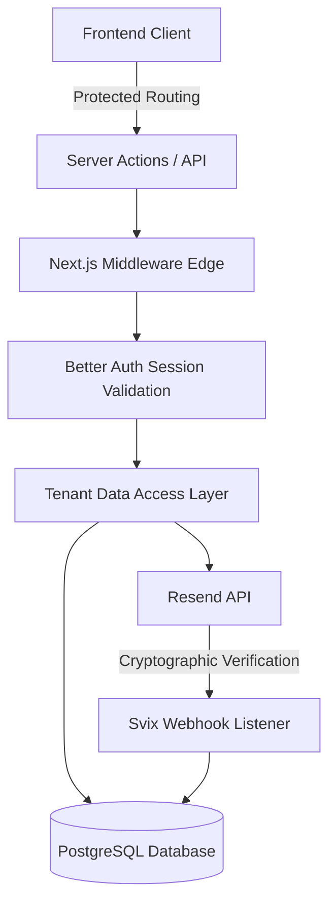
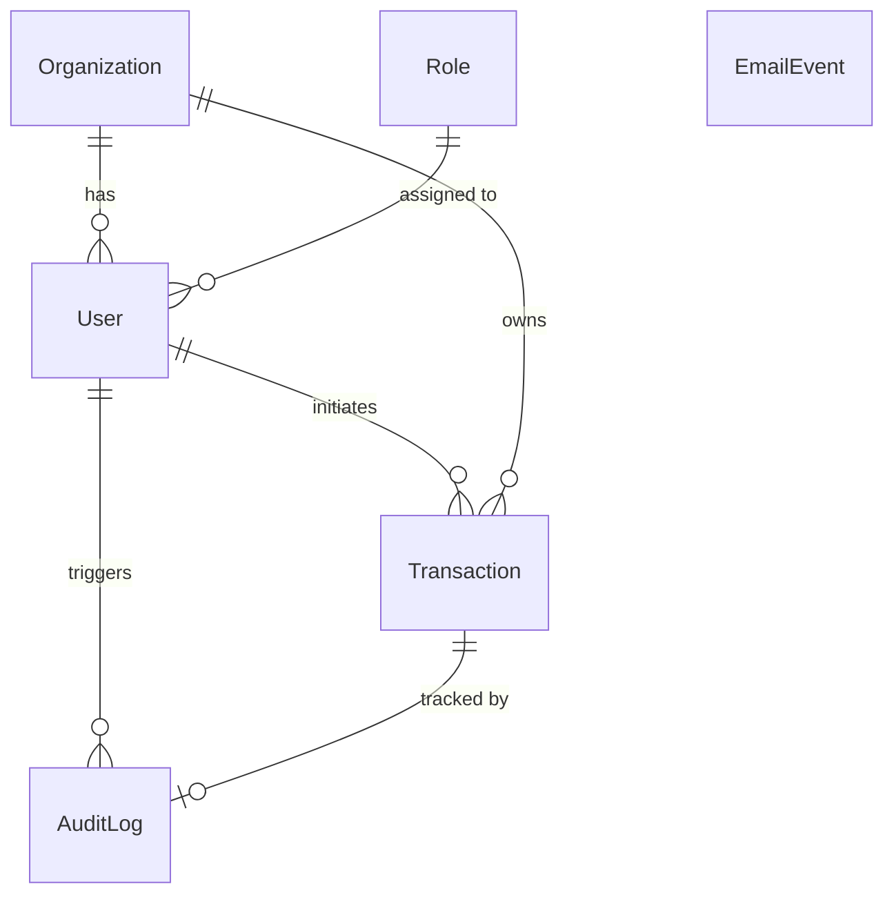

# Secure Transaction System

## Overview
The Secure Transaction System is an enterprise-grade multi-tenant platform designed to securely process, validate, and record financial transactions. It employs a rigid authorization matrix, isolating tenant data at the Data Access Layer, and utilizes robust atomicity to guarantee that transactional events and their corresponding audit logs are irrevocably tied.

## Features
- **Multi-Tenant Architecture**: Strict boundary enforcement ensuring users can only interact with data pertaining to their assigned organization.
- **Role-Based Access Control (RBAC)**: Centralized permission matrix defining capabilities for `ADMIN`, `MEMBER`, and `GUEST` roles.
- **ACID-Compliant Mutations**: Next.js Server Actions utilize Prisma `$transaction` blocks to ensure atomic inserts for both transaction processing and audit logging.
- **Asynchronous Event Notifications**: Integration with Resend and React Email to deliver transactional activity alerts.
- **Cryptographically Secured Webhooks**: Implementation of `svix` to verify incoming webhook signatures from email dispatch events, recording delivery lifecycles securely into the database.

## Architecture
The application is built on a modern full-stack TypeScript architecture.



## Tech Stack
- **Framework**: Next.js 15 (App Router)
- **Language**: TypeScript
- **Database**: PostgreSQL
- **ORM**: Prisma (v5.22.0)
- **Authentication**: Better Auth
- **Validation**: Zod
- **Email Delivery**: Resend & React Email
- **Styling**: Tailwind CSS

## Project Structure
- `/prisma`: Database schemas, migrations, and Faker-driven seed logic.
- `/src/app/(auth)`: Client-side pages for authentication.
- `/src/app/dashboard`: Protected views and transaction creation interfaces.
- `/src/app/admin`: Strictly protected control panel for global monitoring.
- `/src/app/api`: Serverless route handlers for transactional APIs and webhooks.
- `/src/app/actions`: Secure Next.js Server Actions.
- `/src/lib`: Core utilities (Auth config, Permissions matrix, Tenant DAL, Zod schemas).
- `/src/emails`: React Email templates.

## Database Design
The relational model revolves around multi-tenant boundaries.



## Authentication & Authorization
Authentication is handled via Better Auth, injecting session cookies and establishing identity. Authorization is entirely decoupled from the frontend router. Instead, `src/lib/permissions.ts` exports a strongly-typed `hasPermission` utility which is invoked directly against the user's role on every secure query.

## Multi-Tenant Security
All queries to the database pass through `src/lib/tenant.ts`. The `secureQuery()` wrapper automatically extracts the session, derives the implicit `organizationId`, and enforces role limits. Client requests can never spoof an `organizationId` directly.

## API Endpoints
- `GET /api/transactions`: Retrieves a payload of the active organization's transactions.
- `POST /api/transactions`: Creates a transaction securely.
- `POST /api/webhooks/resend`: The Svix-verified listener that ingests email lifecycle events.

## Server Actions
- `createTransactionAction`: Server Action designed to ingest Zod-validated payloads from the dashboard UI, bypassing traditional API fetching for streamlined React execution while retaining identical security measures.

## Transactional Email
React Email provides modular component structures (`ActivityAlert.tsx`) to compile HTML payloads. This is offloaded to Resend.

## Resend Webhooks
Resend webhook events (`email.sent`, `email.delivered`, `email.bounced`) are caught and passed through Svix signature validation. Only authentic payloads are parsed and committed to the `EmailEvent` table.

## Environment Variables
Required variables (see `.env.example`):
- `DATABASE_URL`: PostgreSQL connection string.
- `BETTER_AUTH_SECRET`: Secret key for session encryption.
- `RESEND_API_KEY`: Resend API token.
- `RESEND_WEBHOOK_SECRET`: Svix secret provided by Resend.

## Installation
```bash
npm install
```

## Database Setup
To initialize the database, push the schema, and execute the seeder:
```bash
npm run db:setup
```

## Seeding
The database uses `@faker-js/faker` to programmatically generate 3 organizations, 15 users, and realistic relational data to test the tenant boundaries.

## Running Locally
```bash
npm run dev
```

## Security Considerations
- **Boundary Defenses**: Middleware explicitly bounces unauthenticated users away from secure layouts.
- **SQL Injection**: Handled intrinsically via Prisma's query engine.
- **Fault Tolerance**: Non-blocking asynchronous triggers (like outbound email) are wrapped in `try/catch` and will log errors rather than breaking atomic database operations.
