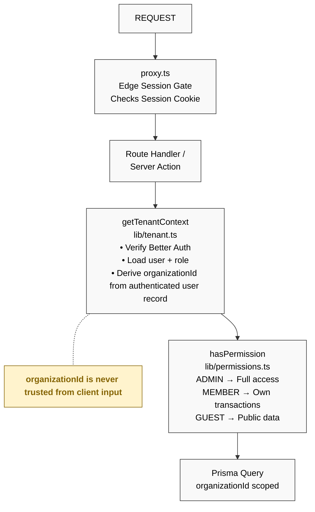

<h1 align="center">SYSTEM ARCHITECTURE — SECURE TRANSACTION SYSTEM</h1>
<hr />

## 1. DATA RELATIONSHIPS

```mermaid
graph TD
    classDef default fill:#f9f9f9,stroke:#333,stroke-width:1px,color:#000,font-family:Arial;
    classDef accent fill:#e6f2ff,stroke:#0066cc,stroke-width:2px,color:#000,font-family:Arial;
    
    Org[ORGANIZATION]:::default -->|1:N| User[USER]:::default
    Role[ROLE]:::default -->|1:N| User
    User -->|1:N| Tx[TRANSACTION]:::default
    User -->|1:N| AL[AUDIT LOG<br>atomic write]:::accent
    Tx -->|1:N| AL
    EE[EMAIL EVENT<br>Resend webhook]:::default
```



The system uses a normalized multi-tenant relational model. Every user strictly belongs to an organization and is assigned a role. Transactions and audit logs inherit this organization context, ensuring data is heavily partitioned by tenant. Audit logs are uniquely bound to transactions through atomic database writes, guaranteeing perfect traceability.


## 2. AUTHORIZATION FLOW



Authorization is enforced at multiple layers. An edge proxy acts as an initial gateway, but deep security is managed by the Tenant Data Access Layer (`lib/tenant.ts`). Context is derived cryptographically from the active session, stripping the client of the ability to spoof organizational boundaries or escalate privileges via tampered payloads.

```mermaid
graph LR
    classDef default fill:#f9f9f9,stroke:#333,stroke-width:1px,color:#000,font-family:Arial,font-size:11px;
    classDef accent fill:#e6f2ff,stroke:#0066cc,stroke-width:2px,color:#000,font-family:Arial,font-size:11px;

    Tx[Transaction<br>Created]:::default --> Atomic[Prisma $transaction<br>Transaction +<br>AuditLog committed<br>atomically]:::accent
    Atomic --> Email[sendTransactionalEmail<br>ONLY after commit]:::default
    Email --> Resend[Resend API<br>accepted / queued]:::default
    Resend --> Delivery[Email Delivery<br>delivered / bounced / failed]:::default
    Delivery --> Webhook[Resend Webhook<br>POST /api/webhooks/resend]:::default
    Webhook --> Svix[Svix Verification<br>Invalid → 400<br>Valid → Parse]:::default
    Svix --> DB[EmailEvent<br>PostgreSQL<br>emailId / eventType / recipient / timestamp]:::default
```

<div style="page-break-after: always;"></div>

<h1 align="center">EMAIL DELIVERY LIFECYCLE</h1>
<hr />



Transactional notifications are dispatched only after a successful, atomic database commit. This decoupling prevents arbitrary API failures from rolling back critical financial logic, allowing the system to monitor asynchronous delivery states purely through webhooks.

### EMAIL EVENT PERSISTENCE

Webhook events received from Resend are cryptographically verified using Svix signatures to prevent spoofing. Once validated, these events update the `EmailEvent` table, ensuring a permanent log of all communications.

> **IMPORTANT**  
> Email failure does NOT roll back the database transaction.  
> DB commit → email dispatch → delivery lifecycle  
> **REQUESTED → ACCEPTED → DELIVERED / BOUNCED / FAILED**

### DISPATCH LOG

```json
{
  "id": "event_12345",
  "eventType": "email.delivered",
  "recipient": "member@example.com",
  "timestamp": "2026-09-12T10:45:00Z",
  "payload": {
    "type": "email.delivered",
    "data": {
      "email_id": "req_67890",
      "to": ["member@example.com"],
      "subject": "Transaction Created"
    }
  }
}
```
